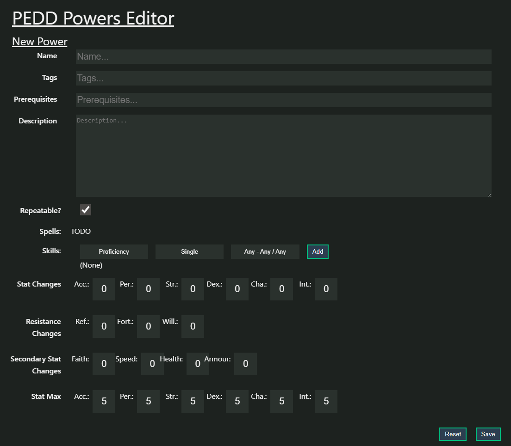

- [My Programming Journey](#my-programming-journey)
- [Professional Work](#professional-work)
- [Github Projects](#github-projects)
  - [This Site ("Personal Site 2") - ***Vue3*** Demo and General Website Building Expertise](#this-site-personal-site-2---vue3-demo-and-general-website-building-expertise)
  - [Restful API - the ***PHP*** /api endpoints of this site](#restful-api---the-php-api-endpoints-of-this-site)
  - [MyTools - ***Vanilla JS*** Expertise](#mytools---vanilla-js-expertise)
  - [PostIt - ***C#*** .NET 8 ASP.NET MVC \& Razor Pages Demo](#postit---c-net-8-aspnet-mvc--razor-pages-demo)
  - [My own Content Management System - ***Python*** and ***MD*** based](#my-own-content-management-system---python-and-md-based)

## My Programming Journey

Over the years I've dabbled in various programming languages and environments. For me it started back in sixth-form when I was 16 where I took my first Computing class that used BASIC as its language of instruction and I was welcomed into the wonderful world of computer programming. Within I learned first to make my form fullscreen and flash random colours. It’s been my way of saying Hello World ever since.

These days my language of professional capability is C#, particularly in the world of .NET (framework & Core) using ASP, where I would train others from near-zero up to business level. In addition to C#, I have managed to drag myself to a level of familiarity with JavaScript (including React, but primarily with Vue which this site is built in), as well as PHP. 

As for my level of HTML and CSS ability, judge that for yourself by this very site!

Below you will find iframes of some sketches written in the handy library of P5JS, as they're easy to demo and its the library I really learned JavaScript with, and relearned programming, in after coming back to it during my long hiatus as a teacher. I’m afraid my old PyGame ventures in python2 from 16 year old me are lost to the void. Thankfully, haha.

## Professional Work

Professsionally, I've worked as a developer since just before returning to the UK in 2022. If you want to know more about my professional career and personal travels, please see [my about page](/about).

I am the sole developer for Downey Designs Ltd. here in the Jewellery Quarter in Birmingham, ensuring both steady progress and modernisation of the site, new features, bug fixes and system maintenance. A large part of the latter is administration of the remote Windows Server we run through HostingUK, and all other IT tasks here in the office. As such I spend just as much of my time in Visual Studio coding C# for ASP.NET MVC as a I do writing SQLServer queries on the database or updating the front end in my custom Javascript framework. I'm also responsible for managing accounts and access in Microsoft 365 Admin; installing, uninstalling and setting up software and hardware in the office (phones, computers, scanners etc...); and much more.

The main thrust of my role is in creating new and replacement pages for the website (which doubles as our store-front presence as well as internal administraiton platform) from older versions at various stages of .NET history, in order to one-day transition to modern .NET (that would be, at time of writing, .NET9), as well as providing new functionality for the office, our parent company and the stores on the highstreet.

Before this, I worked as a C# trainer at Sparta Global, where I taught others the techniques of development (and automated testing). Working at Sparta Global, as a trainee and primarily as a trainer, I was involved in many demonstration projects for the various cohorts who were producing them to demonstrate their skills practically.

Unfortunately all of the above is not something that can be shown. My SpartaGlobal account has since become inaccessible to me and for security reasons the pricate repo for my current work is not something I will share. As such, I've decided to put together a few publically available demo projects, providing a link to my public github repositories.

## Github Projects

My main demo projects are listed below, but if you're interested in my older Laravel, React (via Gatsby) and my other public projects please find them all [here](https://github.com/Tamillis?tab=repositories&q=&type=public).

### This Site ("Personal Site 2") - ***Vue3*** Demo and General Website Building Expertise

The immediate and most illuminating project is the repo for this site itself! It is of course supposed to be a demonstration of my skills, as the landing page's terminal described. It began life as a demonstration of my free-lance learning, and therefore my ability with my chosen stack: VueJS, PHP and MySQL. 

It has been steadily worked on ever since (mostly as a vehicle for my own personal projects in my personal life). Two of these projects are hosted here and doubles as demonstrations. My own version of the "World's Greatest Roleplaying Game" D&D is called [PEDD](/PEDD) and is a detailed demonstration of my command of using VueJS. My worldbuilding project is called the "Materium Existentiae", and the custom-built Wiki for it can be found here: [mewiki](/mewiki). It, and other articles on this site (including this portfolio) make use of markdown files and a python script that is my own simple CMS. This exposes server-hosted markdown files to a vue component able to load the marked down using `Marked.js`.

I also use this site to display my graphics programming, as can be seen by the home page's faux terminal, the snowflakes gently falling behind me, and the spinning globe on my [About](/about) page: using JS libraries (the Canvas API, ThreeJS, P5.js etc.).

Check out the source code for this site [here](https://github.com/Tamillis/Personal_Site_2).

### Restful API - the ***PHP*** /api endpoints of this site
For my main personal project on this site, the PEDD game, its character creator and the management of the game, I use a handful of api endpoints to perform CRUD operations on the set of JSON files that I use as my data store (both because this project is not enough to warrent a SQL database, and I just didn't need one).

The API is written now also as a demonstrator, following RESTful principles and general good coding practices, as well as proficiency in PHP

See the code here: [Personal Site 2 API](https://github.com/Tamillis/Personal_Site_2/tree/main/personal_site/api)

A snippet of it looks like this:

```php
switch ($controller) {
    case 'powers':
        log_msg("Serving powers.");

        $powersController = new PowersController();
        switch ($action) {
            case 'index':
                $powersController->index($param);
                break;
            default:
                log_err("Invalid action $action", 404);
                API::respond(["error" => "Invalid action $action"], 400);
                break;
        }
```

This includes an admin page that is locked behind a login system, but see a screenshot of it here:


### MyTools - ***Vanilla JS*** Expertise

This repository hosts my own custom JavaScript framework, as well as a number of smaller projects I've used professionally. It primarily demonstrates my fluency in vanilla javascript (among the various fun scripts you see running on this site), but also my ability to tackle and produce complex tools that I actually use on a daily basis.

`Tablemaker.js` is the most important of these tools (the above mentioned framework), which is designed to easily and quickly take tabular JSON data that can look like this:

```js
TODO: tabular json data
```

And produce nice, easy-to-use tables that look like this:

<div id="tablemaker-demo-table-container">TODO: the tablemaker demo</div>

Find MyTools [Here](https://github.com/Tamillis/MyTools) and the Tablemaker (with many more examples and explained functionality) README specifically [Here](https://github.com/Tamillis/MyTools/blob/main/TableMaker/README.md).

### PostIt - ***C#*** .NET 8 ASP.NET MVC & Razor Pages Demo


PostIts is a demonstration of the core capabilities that I would teach others to have (combining both the C# Developer and C# Automation Tester streams). Using C# ASP.NET, Entity Framework, SQL Server, NUnit, SpecFlow, Razor pages and SOLID programming practices. It also demonstrations techniques like the creation of a service layer (to allow for better testing) as well as integration testing through Selenium, a web scraper that'll test the site itself, and Postman to test the API calls.

The site itself is supposed to be a simple clone of twitter, allowing users to register, log in, make posts that will be seen by others, comment on others' posts and like / unlike posts. The main posts are also ordered based on an *algorithm* (it's very simple, a weighting of recency and number of likes only ^^).

The homescreen looks like this:


Greater detail, more screenshots, and an in-depth walkthrough of the process of creation by following a particular User Story from inception to implementation, can be read in the README of the project.

Find it [Here](https://github.com/Tamillis/PostIt)

### My own Content Management System - ***Python*** and ***MD*** based
This very article, as well as every other you see here on the site, is written in markdown and later embedded in the vue pages via a `Marked.js` call.

The `/PEDD/Mewiki` pages are that taken to another level, using my modest python abilities to generate the necessary routes and pages dynmaically from all the folders and MD files stored in my wiki source:

```python
import os
import json

def path_to_dict(path):
    name = 'Wiki' if os.path.basename(path) == '' else os.path.basename(path)
    d = {}
    d['name'] = name
    d['path'] = path
    if os.path.isdir(path):
        d['type'] = 'dir'
        d['contents'] = [path_to_dict(path+'/'+content) for content in os.listdir(path)]
    else:
        d['type'] = 'file'
    return d

route_map = path_to_dict("./src/assets/wiki")
print(json.dumps(route_map, indent=4))

f = open("./src/assets/wikiroutes.json", "w")
f.write(json.dumps(route_map, indent=4))
f.close()
```

It's simple and rough-and-ready, but entirely customisable and suited to my needs for this project.
